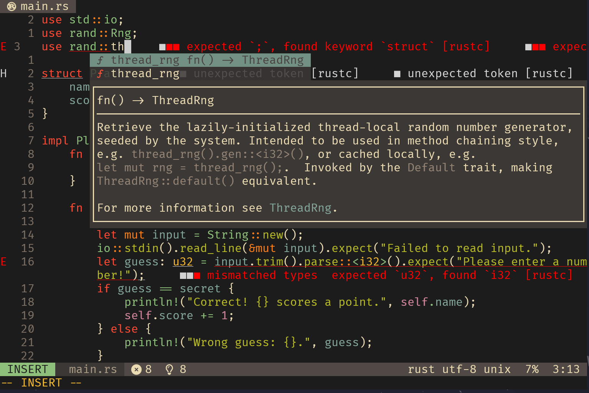
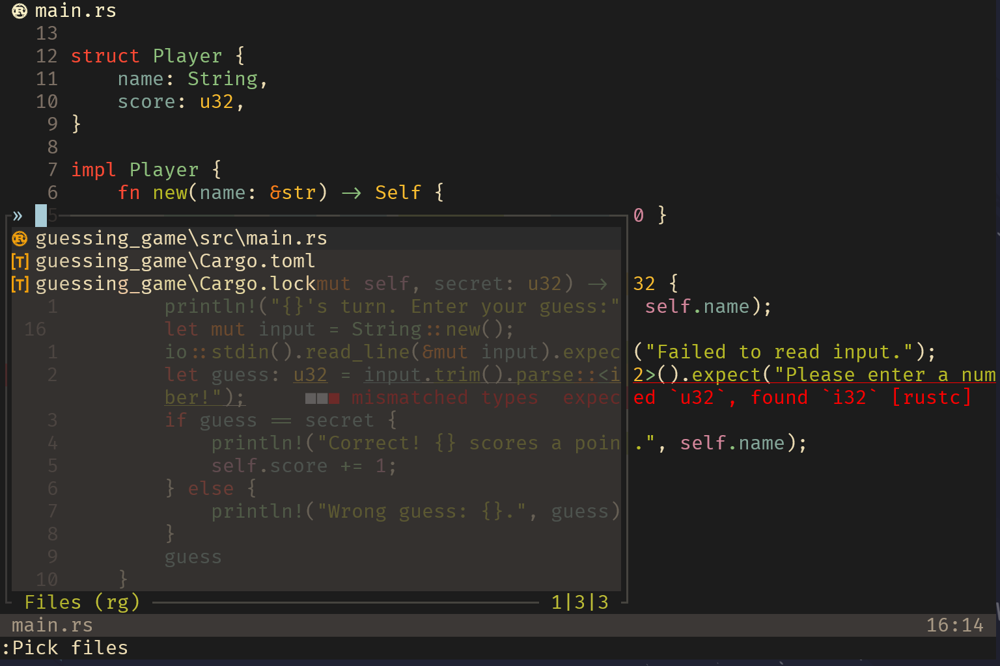

# Neovim Nightly Configuration
## This configuration only works in Neovim Nightly
## NVIM v0.12.0-dev-934+ga9a4c271b1

This is a high-performance, minimal, and extensible Neovim Nightly configuration designed around fast startup, sane defaults, and modern plugin architecture. Built for Neovim 0.10+.

---

## Configuration Screenshots

## Features

- ⚡ Fast startup using `vim.loader`
- 🧼 Clean UI with custom `fillchars`, `guicursor`, and `winblend`
- ⌨️ Keymap-driven workflow with no-yank deletes, quick buffer cycling, Harpoon nav, and LSP integration
- 🛠️ Language support for Lua, Python, and Go via native LSP
- 🧩 Minimal plugin set using:
  - `mini.nvim` suite
  - `harpoon` (v2)
    - You will have to clone it into your nvim-data:
    - git clone --branch harpoon2 https://github.com/ThePrimeagen/harpoon.git
  - `oil.nvim`
  - `mason.nvim`
  - `Pick` interface via `mini.pick`
- 🎨 Built-in color scheme cycling (`tokyonight`, `rose-pine`, `vague`, etc.)
- 🧠 Smart formatting dispatch per filetype (`ruff`, `gofmt`, etc.)

---

## Requirements

- Neovim **Nightly (0.11+)**
- `git` for plugin fetching via `vim.pack.add()`
- Language-specific tools (e.g. `ruff`, `gofmt`, `lazygit`) if used

---

## Plugin Architecture

Managed via [`vim.pack.add`](https://neovim.io/doc/user/repeat.html#vim.pack):

- `neovim/nvim-lspconfig`
- `mason-org/mason.nvim`
- `stevearc/oil.nvim`
- `echasnovski/mini.nvim`
- `vague2k/vague.nvim`
- `ellisonleao/gruvbox.nvim`
- `rose-pine/neovim`

Managed via [`mini.deps`](https://github.com/echasnovski/mini.deps):

- `nvim-lua/plenary.nvim`
- `ThePrimeagen/harpoon` (`harpoon2` branch)

---

## Key Bindings

### General
| Key                  | Action                               |
|----------------------|--------------------------------------|
| `<leader>w`          | Trim trailing space + save           |
| `<leader>q`          | Quit                                 |
| `<leader>b[n/p/d/f]` | Buffer next/prev/delete/delete force |
| `<leader>cm`         | Open Mason                           |
| `<C-p>`              | Open PowerShell terminal             |
| `<leader>gg`         | Open LazyGit terminal                |

### File Navigation
| Key              | Action                |
|------------------|-----------------------|
| `<leader>f`      | Pick files            |
| `<leader>fb`     | Pick buffers          |
| `<leader>fg`     | Pick grep_live        |
| `<leader>fc`     | Pick colorschemes     |
| `<leader>fw`     | Pick word             |
| `<leader>h`      | Pick help             |
| `<leader>e`      | Open Oil              |
| `<leader>ef`     | Open MiniFiles        |

### Harpoon
| Key              | Action                |
|------------------|-----------------------|
| `<leader>a`      | Add to Harpoon        |
| `<C-e>`          | Toggle menu           |
| `<C-h/t/n/s>`    | Select slot 1–4       |
| `<leader>hx`     | Clear list            |

### LSP
| Key              | Action                     |
|------------------|----------------------------|
| `<leader>lf`     | Format via LSP             |
| `<leader>ca`     | Format + clean (Go/Python) |

### UI
| Key              | Action                     |
|------------------|----------------------------|
| `<leader>t`      | Cycle color schemes        |
| `<leader>tt`     | Toggle transparency        |
| `<leader>ta`     | Enable cursor animations   |
| `<leader>wz`     | Zoom current window        |

### Editing Behavior
| Key              | Action                              |
|------------------|-------------------------------------|
| `d/c/x`          | Mapped to blackhole register (`"_`) |
| Visual `d/c`     | Same as above                       |

---

## Language Support

Configured LSPs:

- **Lua** (`lua_ls`)
- **Python** (`pyright`, `ruff`)
- **Go** (`gopls` with staticcheck and param analysis)
- **Rust** (`rust_analyzer`)

Custom `LspAttach` handler enables completion autotriggering. (Could optionally use blink.cmp).

---

## UI & Colors

Themes supported:

- `rose-pine-main`
- `rose-pine-moon`
- `tokyonight`
- `vague` (with transparent statusline)
- `retrobox` (fallback theme)

Cycle using `<leader>t`. Default: `rose-pine-moon`.

---

## Notes

- Filetype-specific formatters are dispatched using `jobstart`, with auto-reload.
- Shell-dependent commands (PowerShell, LazyGit) assume presence in `$PATH`.
- No telescope, cmp, lualine, or treesitter used — intentional minimalism via `mini.nvim`.

---

## License

MIT
